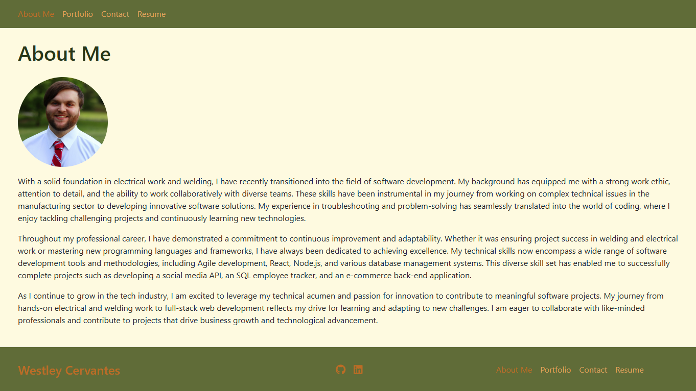

# Westley's MERN Portfolio

## Description

Welcome to my MERN Portfolio! This project showcases a collection of my work, including various applications and projects I have developed. It serves as a comprehensive display of my skills and experience in web development. The portfolio is built using modern web technologies and is designed to be responsive, ensuring a seamless experience across different devices and screen sizes.

Deployed site on Render:\
https://react-porfolio-project.onrender.com/

## Table of Contents

- [Installation](#installation)
- [Usage](#usage)
  - [About Me](#about-me)
  - [Portfolio](#portfolio)
  - [Contact](#contact)
  - [Resume](#resume)
- [License](#license)
- [Questions](#questions)

## Installation

After cloning the repo, simply run `npm i` to install all dependencies.

## Usage

### About Me
Learn more about my background and the journey that brought me to where I am today. This section also showcases the skills I have acquired and my future goals.

### Portfolio
Browse through a collection of my projects, each with detailed descriptions, the technology stack used, and links to live demos and GitHub repositories. This section highlights the work I have done and the skills I have applied.

### Contact
Find links to my GitHub, LinkedIn, and email. The contact form does not send any information and is included to demonstrate my capabilities.

### Resume
Access my resume directly within the portfolio via an integrated PDF viewer. This allows you to read my resume without leaving the site. Additionally, you can download a PDF version of my resume for offline viewing or sharing, ensuring easy access to my professional qualifications.

## License

Licensed under the MIT license.

[MIT License](https://opensource.org/licenses/MIT)

## Questions

For any questions, please contact WestleyCervantes@gmail.com. Visit [wacwestley30](https://github.com/wacwestley30) for more projects.
